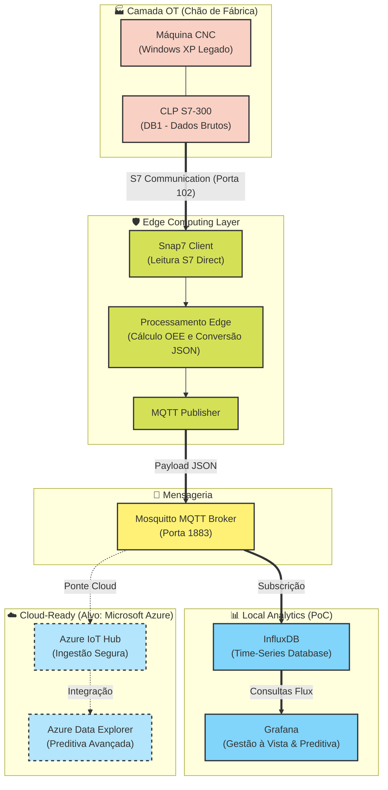

# 🏭 ZF Lab: PoC de IoT Edge (Cloud-Ready) para Monitoramento de OEE e Preditiva em CNCs

## 🎯 A Solução: Arquitetura IoT Edge orientada a Nuvem (Azure-Ready)
Este projeto é uma Prova de Conceito (PoC) que implementa um **Edge Gateway** industrial. Em vez de interagir com o sistema operacional da máquina, o Gateway se comunica diretamente com o CLP (via protocolo S7 Communication puro) no nível de hardware.

Os dados brutos são processados na borda (Edge Computing) e convertidos em payloads JSON leves, transmitidos via MQTT. Esta arquitetura foi desenhada para ser "Cloud-Ready", sendo o estágio preparatório ideal para ingestão massiva de telemetria no **Microsoft Azure (Azure IoT Hub e Azure Data Explorer)**.

## 🏗️ Arquitetura do Sistema (IT/OT Flow)

## ⚙️ Stack Tecnológico
* **OT Layer:** Servidor Snap7 emulando os Data Blocks (DBs) do CLP de uma máquina CNC.
* **Edge Layer:** Script Python atuando como Edge Device. Realiza a leitura dos bytes, converte os tipos de dados e aplica lógicas locais.
* **Mensageria Segura:** Eclipse Mosquitto (MQTT Broker) atuando como barramento de dados.
* **Local Data & Analytics:** InfluxDB (Time-Series) e Grafana rodando em contêineres Docker (IaC) para processamento, agregação e gestão à vista local.

## 📊 Engenharia de Confiabilidade e Monitoramento Baseado em Condição (CBM)
Para validar os modelos analíticos, o projeto implementa um motor de física realista que simula os seguintes KPIs de PCM e Produção:
1. **Curva Térmica Assintótica:** O modelo matemático do mancal (*bearing*) respeita a inércia térmica (Lei de Resfriamento de Newton), essencial para estudos de limites de controle preditivo.
2. **Espectro de Vibração RMS:** Programado com correlação direta à temperatura e ao *Spindle RPM*, simulando ressonância mecânica e desbalanceamento dinâmico.
3. **Machine Analytics & OEE:** Cálculo orgânico de *Cycle Time* e *Production Rate (PPM)*. O sistema identifica autonomamente micro-paradas, alarmes severos e operação normal, gerando as bases para cálculo de Disponibilidade e Performance.

## 👨‍💻 Autor
**Ricardo A. Ogasawara**  
*Engenheiro de Controle e Automação | MBA em Gestão de Manutenção 4.0*  
Especialista em PCM, Confiabilidade e Integração de Arquiteturas IT/OT para ecossistemas industriais complexos.
